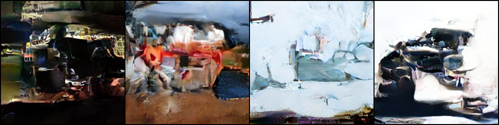
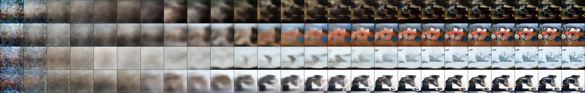

# DiT 复现

[English](README.md) | 中文

基于 Peebles & Xie (ICCV 2023) **Diffusion Transformers** 的简化复现：冻结 SD KL-f8，在 32×32×4 latent 上训练类别条件 **DiT-S/2**；骨干、损失、CFG、250 步 respacing 对齐官方实现 [facebookresearch/DiT](https://github.com/facebookresearch/DiT)。

**论文：**

- [Scalable Diffusion Models with Transformers](https://arxiv.org/abs/2212.09748)

## 功能

- 冻结官方 KL-f8（CompVis `AutoencoderKL`，兼容 `sd-vae-ft-ema/mse`）
- 前向扩散；ε-预测 + LEARNED_RANGE 方差；`L = MSE(ε) + VB(Σ)`
- 类别条件：`c = t_emb + y_emb`，adaLN-Zero 注入各 Transformer block
- CFG：训练 class token dropout 0.1；`cfg_scale≠1` 时 `forward_with_cfg`，仅作用于 latent 前 3 通道
- 采样：250-step SpacedDiffusion 上的 DDPM（默认 / FID），或同子链 DDIM（训练预览）
- EMA 0.9999；训练出图使用固定噪声与 `SAMPLE_CLASS_IDS`
- TensorBoard；FID（训练 ImageFolder，Inception-v3 2048 维）

## 项目结构

```
my_DiT/
├── train.py              # 训练 / 重建 / 采样 / FID
├── dit.py                # DiT-S/p（PatchEmbed、adaLN-Zero、CFG）
├── vae.py                # CompVis KL-f8 Encoder/Decoder 与权重转换
├── diffusion.py          # ADM 日程、损失、respace、DDPM/DDIM
├── dataset.py            # ImageFolder + ADM center-crop
├── requirements.txt
├── id_list.txt           # ImageNet-100 编号 ↔ 类名
├── docs/
│   ├── DiT-note.html
│   └── figs/
├── data/imagenet100/
└── runs/
```

## 环境安装

Python 3.11+，NVIDIA 驱动需支持 CUDA 12.0+。

```bash
pip install -r requirements.txt
```

VAE 权重需本地提供（训练不自动下载）：

```bash
mkdir -p models/sd-vae-ft-ema
# https://huggingface.co/stabilityai/sd-vae-ft-ema/resolve/main/diffusion_pytorch_model.safetensors
# https://huggingface.co/stabilityai/sd-vae-ft-mse/resolve/main/diffusion_pytorch_model.safetensors
# CompVis：https://ommer-lab.com/files/latent-diffusion/kl-f8.zip
```

`--vae_ckpt` 可为 `.safetensors` / `.ckpt` / 含上述文件的目录。

## 使用示例

入口为 `train.py`。默认训练；`--recon` / `--sample` / `--eval_fid` 切换模式。

### 检查 VAE

```bash
python train.py --recon \
  --vae_ckpt models/sd-vae-ft-ema/diffusion_pytorch_model.safetensors \
  --data_dir data/imagenet100/train \
  --out runs/vae_check
```

输出 `vae_recon.png`（上排输入，下排 `decode(mode(z))`）。无 ImageFolder 时使用随机图。

### 训练

`--data_dir` 格式：`root/<class>/*.{jpg,png,webp}`。类别 id 为文件夹名字母序，须等于 `--num_classes`。ImageNet-100 使用 `data/imagenet100/train`。

```bash
python train.py \
  --vae_ckpt models/sd-vae-ft-ema/diffusion_pytorch_model.safetensors \
  --data_dir data/imagenet100/train \
  --num_classes 100 \
  --out runs/dit_s2_in100
```

有效 batch `B = batch_size × (global_batch_size // batch_size)`。论文 `B = 256`、`lr = 1e-4`；线性缩放 `lr = 1e-4 × B / 256`（例如 `B = 32` 时 `1.25e-5`）。

输出目录：`ckpt.pt`（model / ema / opt / step）、`samples_{step}.png`、`tb/`。

预览类别为 `train.py` 中 `SAMPLE_CLASS_IDS` 的前 `--n_samples` 项，对照 `id_list.txt`。

### 断点续训

```bash
python train.py \
  --vae_ckpt models/sd-vae-ft-ema/diffusion_pytorch_model.safetensors \
  --data_dir data/imagenet100/train --num_classes 100 \
  --resume runs/dit_s2_in100/ckpt.pt --out runs/dit_s2_in100
```

### 采样

加载 EMA。默认 250-step DDPM + respacing。

```bash
python train.py --sample \
  --ckpt runs/dit_s2_in100/ckpt.pt \
  --vae_ckpt models/sd-vae-ft-ema/diffusion_pytorch_model.safetensors \
  --cfg_scale 1.5 --n_samples 8 \
  --out runs/dit_s2_in100
```

- 类别：`SAMPLE_CLASS_IDS`；`--class_label 16` 则整批固定该类。
- `--sampler ddpm|ddim`，`--num_sampling_steps 250`。
- `--progress_every 10` 写出 `progression.png`：行=样本，列=`x0_hat`（左噪声 → 右干净）。

### TensorBoard

```bash
tensorboard --logdir runs/dit_s2_in100/tb
```

`train/loss`、`train/ms_per_step`、`samples/grid`、`eval/fid`。

### FID 评测

相对 `--data_dir` 训练图像。论文口径为 50K 张、250-step DDPM、无 CFG。训练期默认 `--fid_every 0`。

```bash
python train.py --eval_fid \
  --ckpt runs/dit_s2_in100/ckpt.pt \
  --vae_ckpt models/sd-vae-ft-ema/diffusion_pytorch_model.safetensors \
  --data_dir data/imagenet100/train \
  --n_fid 10000 --out runs/dit_s2_in100
```

`--fid_final` 在训练结束时评一次；`--fid_every N` 每 N 步评一次。

## 实现细节

### 第一阶段：KL-f8 Encoder / Decoder

与官方 DiT 相同，为 Stable Diffusion KL-VAE（f=8），非 VQ-GAN。模块树按 CompVis `AutoencoderKL` 实现，可加载：

- HuggingFace `sd-vae-ft-*`（`convert_hf_vae_state_dict` 将 `down_blocks` 等映射为 CompVis 键，Linear 改为 1×1 Conv）
- `kl-f8.zip` Lightning `.ckpt`

`KL_F8_DDCONFIG`：`ch=128`，`ch_mult=(1,2,4,4)`，每级 2 个 ResnetBlock，256→128→64→32。`attn_resolutions=[]`（下/上采样路径无 attention），bottleneck 保留 `AttnBlock`。Encoder 输出 2×4 通道（均值 / 对数方差），`sample()` 后乘 0.18215。Decoder 对称。训练时 VAE 冻结。

256×256 RGB → 32×32×4 latent。`--recon` 使用 `mode()`；扩散训练使用 `sample()`。

### Transformer：DiT-S/2

`dit.py` 对齐官方 `models.py`，不依赖 timm。S/2：12 层，`d=384`，6 头，`p=2`，mlp_ratio=4，约 33M 参数。

1. `PatchEmbed`：`Conv2d(4→384, k=2, s=2)` → 256 token。
2. 冻结 2D sin-cos（MAE；`grid_w` 在前）。
3. `c = t_emb + y_emb`。时间步：256 维频率（cos 后 sin）+ SiLU MLP。标签：`Embedding(C+1, 384)`，额外一类为 CFG uncond token。
4. `DiTBlock`：无仿射 LayerNorm + MHSA + GELU(tanh) MLP。条件经 adaLN-Zero：`SiLU→Linear(d→6d)` 得到 attn/MLP 的 γ, β, α。调制层与 FinalLayer 线性层零初始化，初始为恒等映射。
5. `FinalLayer`：adaLN（2d）+ Linear，unpatchify → 8×32×32（前 4 通道 ε，后 4 通道方差）。

Attention 为手写 `qkv` Linear + softmax，与 timm 默认实现参数布局一致。

### 条件与 CFG

| 阶段 | 行为 |
|------|------|
| 训练 `DiT.forward` | `y_embedder(y, self.training)`；`train=True` 时以 0.1 概率将 y 替换为 `num_classes` |
| 训练预览 `quick_sample` | `diffusion_sample(..., cfg_scale=args.cfg_scale)`，默认 1.0（关闭） |
| `--sample` / FID | `--cfg_scale≠1` 时启用 |

启用时 `diffusion_sample` 将 batch 与标签扩展为 `[cond | uncond]`，经 `forward_with_cfg`。Guidance 仅作用于输出前 3 通道（附录 A）：

```
ε̂_{1:3} = ε_uncond + s (ε_cond − ε_uncond)
```

CFG 不进入训练 loss。

### 扩散：DDPM respace 与 DDIM

训练：`T=1000`，ADM 线性 `β = linspace(1e-4, 2e-2)`。8 通道输出；LEARNED_RANGE 将 `[-1, 1]` 插值到 `[log β̃_t, log β_t]`。VB 中 ε detach。`clip_denoised=False`。

采样均先 `make_spaced_diffusion`（ADM `SpacedDiffusion`）：从 1000 个 `ᾱ` 抽取 250 个，`β'_i = 1 − ᾱ_{t_i} / ᾱ_{t_{i-1}}`，再在新链上逐步反推。网络时间步由 `tmap` 映射回 `{0, …, 999}`。`--ddim_spacing` 未使用。

| 调用点 | 采样器 | 更新 |
|--------|--------|------|
| `--sample` / `--eval_fid` 默认 | DDPM 250 | `μ_θ + σ_θ z`，使用预测 Σ |
| 训练 `samples_{step}.png` | DDIM 250，η=0 | 确定性，不使用 Σ 加噪 |

DDPM respace 为抽稀后的马尔可夫链；DDIM 为同一子链上的非马尔可夫反过程。论文 FID 使用前者。

## 常用参数

| 参数 | 默认值 | 说明 |
|------|--------|------|
| `--patch_size` | 2 | S/2 对应 256 token |
| `--num_classes` | 1000 | ImageNet-100 设为 100 |
| `--max_steps` | 400000 | 优化器步 |
| `--batch_size` | 32 | 微批 |
| `--global_batch_size` | 32 | 有效 batch 见上文 |
| `--lr` | 1.25e-5 | 随有效 batch 线性缩放 |
| `--T` / `--beta_start` / `--beta_end` | 1000 / 1e-4 / 2e-2 | ADM 线性日程 |
| `--sampler` | `ddpm` | `--sample` 与 FID；训练预览为 DDIM |
| `--num_sampling_steps` | 250 | respace 链长 |
| `--cfg_scale` | 1.0 | 1 关闭 |
| `--sample_every` | 5000 | 固定噪声预览间隔 |
| `--n_fid` | 50000 | FID 生成张数 |
| `--fid_every` | 0 | `0` 关闭 |

## 数据集

| 项目 | 本仓库 | 论文 |
|------|--------|------|
| 数据集 | [clane9/imagenet-100](https://huggingface.co/datasets/clane9/imagenet-100) | ImageNet-1K |
| 任务 | 100 类条件生成 | 1000 类条件生成 |
| 训练数据 | 126689 | 1.28M |
| 分辨率 | 短边 160，ADM crop 至 256 | 原图 ADM center-crop 256 |
| latent | 32×32×4，×0.18215 | 同 |
| 预处理 | `center_crop_arr` + 水平翻转，[-1, 1] | 同 |
| FID 参考 | `--data_dir` 训练图像 | 见论文 |
| 类名 | 文件夹字母序，`id_list.txt` | ImageNet synset 序 |

## 实验指标

RTX 4090，DiT-S/2，ImageNet-100，batch 32，lr `1.25e-5`，200k steps。采样：class 16（ambulance），250-step DDPM，`--cfg_scale 1.5`。未计算 FID。

<p align="center">
  
</p>
<p align="center"><em>上图：class 16（ambulance）最终样本，250-step DDPM，CFG 1.5。</em></p>

<p align="center">
  
</p>
<p align="center"><em>下图：去噪过程。行=样本，列=x0_hat，左噪声 → 右干净。</em></p>

## 与论文的差异

骨干、损失、CFG 三通道、250-step DDPM respace、KL-f8、adaLN-Zero 与官方实现一致。

| 项目 | 本仓库 | 论文 / 官方 DiT |
|------|--------|-----------------|
| 骨干 | DiT-S/2，手写 Attention/Mlp | 同结构；官方使用 timm |
| 第一阶段 | sd-vae-ft-* / kl-f8，冻结 | `stabilityai/sd-vae-ft-ema` |
| 数据 | ImageNet-100，160px 放大至 256 | ImageNet-1K 原分辨率 crop |
| 类数 | 100 | 1000 |
| 全局 batch | 32 | 256（DDP） |
| 学习率 | 1.25e-5 | 1e-4 |
| 步数 | 200k | S/2 缩放表 400K；XL/2 最终 7M |
| 训练预览 | DDIM 250 | 官方 train.py 不出图 |
| `--sample` 默认 | DDPM 250 + respace | `create_diffusion("250").p_sample_loop` |
| CFG | 默认关闭；可选 1.5，前 3 通道 | FID 无 CFG；SOTA 图 s=1.5 |
| 并行 / 精度 | 单卡，可选梯度累积 | DDP；可选 fp16 |
| FID | pytorch-fid | ADM TF Inception |

笔记：`docs/DiT-note.html`。

## 引用

```bibtex
@inproceedings{peebles2023dit,
  title={Scalable Diffusion Models with Transformers},
  author={Peebles, William and Xie, Saining},
  booktitle={ICCV},
  year={2023}
}
```
